### [Index](https://github.com/K-PaaS/container-platform/blob/playpark/README.md) > [CP Use](../Readme.md) >  플레이 파크 포털 사용 가이드

<br>

## Table of Contents

1. [문서 개요](#1)
  * [1.1. 목적](#1-1)
  * [1.2. 범위](#1-2)
2. [컨테이너 플랫폼 포탈 접속](#2)
  * [2.1. 컨테이너 플랫폼 포탈 접속](#2-1)
3. [컨테이너 플랫폼 포털을 활용한 MySQL과 WordPress 배포](#3)
  * [3.1.컨테이너 플랫폼 포탈 활용한 MySQL 배포](#3-1)
  * [3.1.1. 퍼시스턴트 볼륨 생성](#3-1-1)
  * [3.1.2. 퍼시스턴트 볼륨 클레임 생성](#3-1-2)
  * [3.1.3. MySQL 디플로이먼트 생성](#3-1-3)
  * [3.1.4. MySQL 서비스스 생성](#3-1-4)
  * [3.2. 컨테이너 플랫폼 포탈을 활용한 WordPress 배포](#3-2)
  * [3.2.1. 퍼시스턴트 볼륨 배포](#3-2-1)
  * [3.2.2. 퍼시스턴트 볼륨 클레임 배포](#3-2-2)
  * [3.2.3. WordPress 디플로이먼트 생성](#3-2-3)
  * [3.2.4. WordPress 서비스 생성](#3-2-4)
  * [3.2.5. 정상배포 확인](#3-2-5)
4. [컨테이너 플랫폼 포탈을 활용한 MySQL과 WordPress 삭제](#4)
  * [4.1. 삭제](#4-1)

<br>

# <div id='1'/> 1. 문서 개요

## <div id='1-1'/> 1.1. 목적
본 문서는 플레이 파크 컨테이너 플랫폼 포털을 활용하여 WordPress 사이트와 MySQL 데이터베이스를 어떻게 배포하는지 보여준다.


<br>

## <div id='1-2'/> 1.2. 범위
본 문서는 플레이파크 단독형 배포를 기준으로 작성되었다.
플레이 파크 단독형 배포를 기준으로 컨테이너 플랫폼 포털을 활용하여 WordPress와 MySQL을 배포하는 방법을 기술하였다.

<br>

# <div id='2'/> 2. 컨테이너 플랫폼 포탈 접속
## <div id='2-1'/>2.1. 컨테이너 플랫폼 포탈 접속
플레이 파크에 접속해서 로그인을 한다. 
로그인 후 cp portal 대시보드에 접속한다.
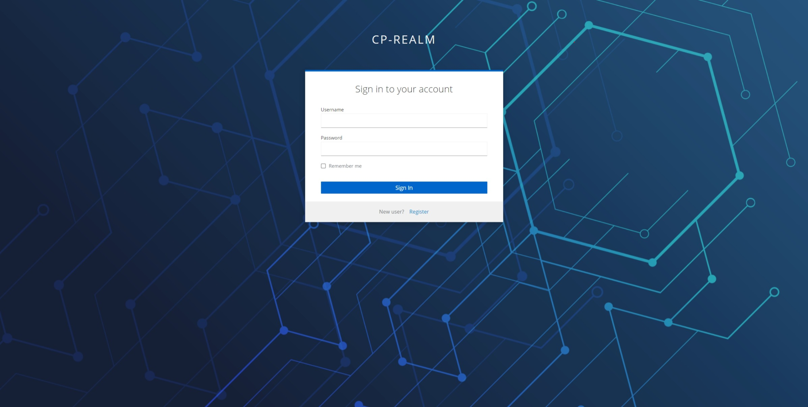
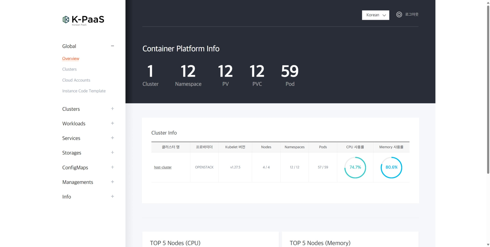

<br>


# <div id='3'/>3. 컨테이너 플랫폼 포털을 활용한 MySQL과 WordPress 배포


## <div id='3-1'/>3.1. 컨테이너 플랫폼 포탈 활용한 MySQL 배포
본 장에서는 플레이파크 컨테이너 플랫폼 포털을 활용하여 MySQL의 배포 방법에 대해 기술하였다.


### <div id='3-1-1'/> 3.1.1. 퍼시스턴트 볼륨 생성
MySQL은 각 데이터를 저장할 퍼시스턴트볼륨이 필요하다.
많은 클러스터 환경에서 설치된 기본 스토리지클래스가있는데 다음 코드는 기본 스토리지클래스를 사용하여 퍼시스턴트볼륨을 생성하는 코드이다.


1. 포탈에 접속을 성공한 이후에 퍼시스턴트 볼륨을 배포하기위해 Storage > Persistenct Volume 버튼을 눌러 접속을 진행한다.
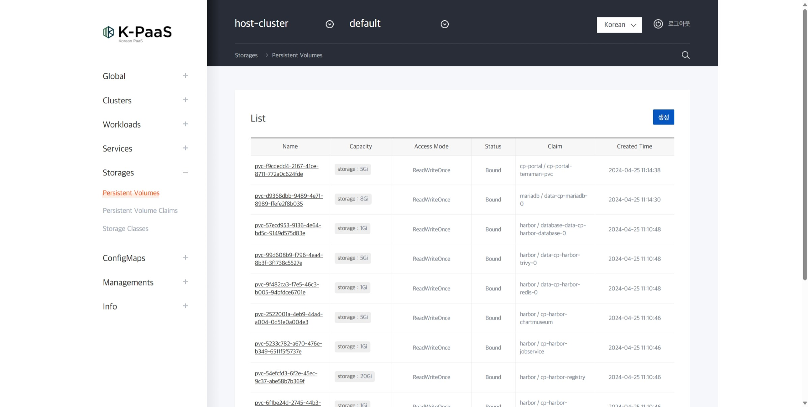


2. "생성" 버튼을 눌러 퍼시스턴트 볼륨 생성창을 띄운다.


3. 퍼시스턴트 볼륨을 생성할 네임스페이스를 선택한 후 코드를 작성한다.
- 작성을 마치면 "저장" 버튼을 누른다.


4. 코드에 문제가 없다면 정상적으로 처리되었다는 팝업창이 뜬다.
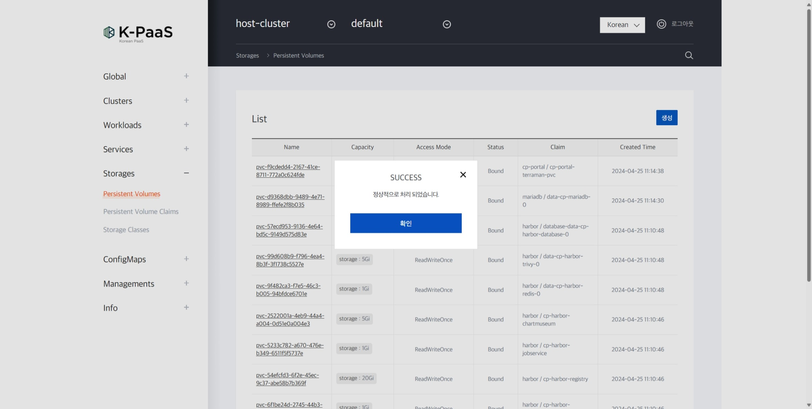


5. 다음과 같이 퍼시스턴트 볼륨이 생성된 모습을 확인할 수있다.
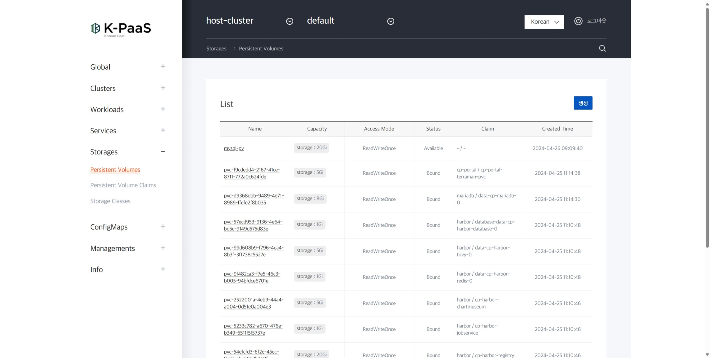


다음 코드는 퍼시스턴트 볼륨을 생성하는 yaml이다.
다음 코드를 참고하여 컨테이너 플랫폼 포탈에서 퍼시스턴트 볼륨을 생성한다.

```
kind: PersistentVolume
apiVersion: v1
metadata:
  name: mysql-pv
  labels:
    app: wordpress
spec:
  capacity:
    storage: 20Gi
  accessModes:
    - ReadWriteOnce
  hostPath:
    path: "/data/k8s/mysql" 
  storageClassName: cp-storageclass

```


### <div id='3-1-2'/> 3.1.2. 퍼시스턴트 볼륨 클레임 생성

1. 퍼시스턴트 볼륨 클레임을 배포하기위해 Storage > Persistenct Volume Claims 버튼을 눌러 접속을 진행한다.
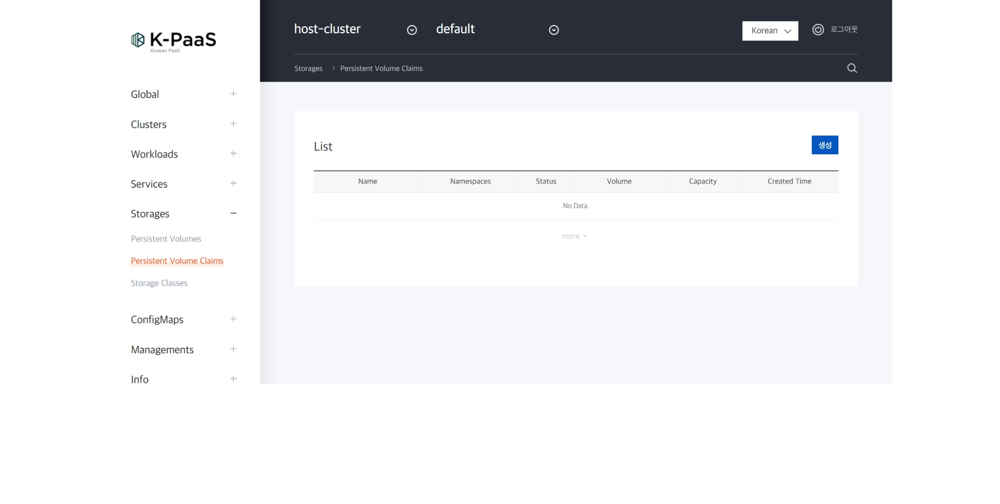


2. "생성" 버튼을 눌러 퍼시스턴트 볼륨 클레임 생성창을 띄운다.
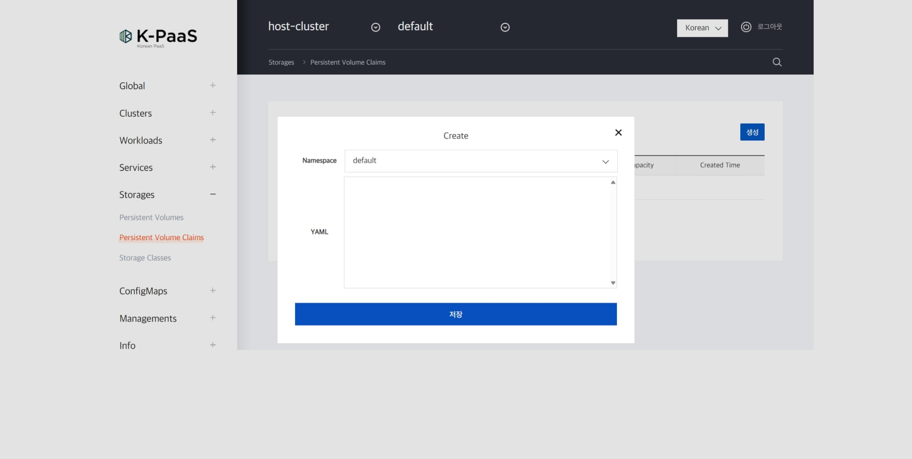


3. 퍼시스턴트 볼륨 클레임을 생성할 네임스페이스를 선택한 후 코드를 작성한다.
- 작성을 마치면 "저장" 버튼을 누른다.
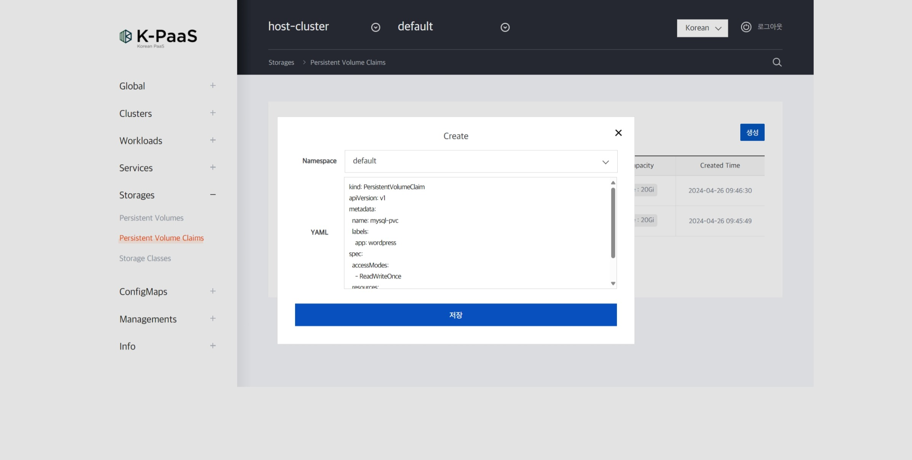


4. 코드에 문제가 없다면 정상적으로 처리되었다는 팝업창이 뜬다.
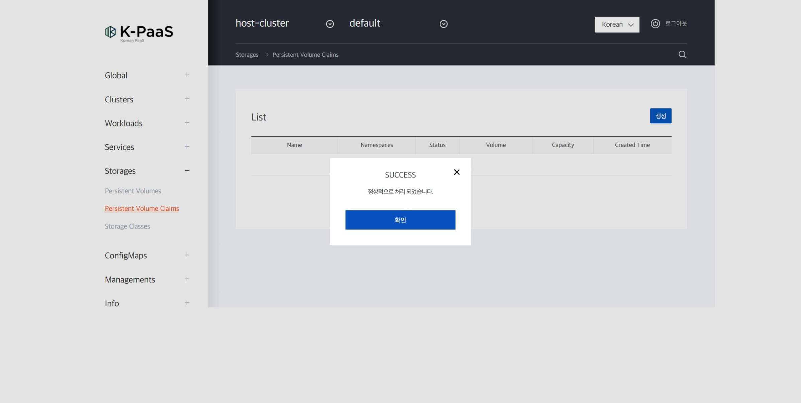


5. 다음과 같이 퍼시스턴트 볼륨이 생성된 모습을 확인할 수있다.


다음 코드는 퍼시스턴트 볼륨 클레임을 생성하는 yaml이다.
다음 코드를 참고하여 컨테이너 플랫폼 포탈에서 퍼시스턴트 볼륨 클레임을 생성한다.

```

kind: PersistentVolumeClaim
apiVersion: v1
metadata:
  name: mysql-pvc
  labels:
    app: wordpress
spec:
  accessModes:
    - ReadWriteOnce
  resources:
    requests:
      storage: 20Gi

```


### <div id='3-1-3'/> 3.1.3. MySQL 디플로이먼트 생성


1. MySql을 디플로이컨트 형식으로 배포하기위해서 workloads > Deployments 버튼을 눌러 접속을 진행한다.


2. "생성" 버튼을 눌러 디플로이먼트 생성창을 띄운다.


3. 디플로이먼트를 생성할 네임스페이스를 선택한 후 코드를 작성한다.
- 작성을 마치면 "저장" 버튼을 누른다.


4. 코드에 문제가 없다면 정상적으로 처리되었다는 팝업창이 뜬다.


5. 다음과 같이 디플로이먼트가 생성된 모습을 확인할 수있다.


다음 코드는 디플로이먼트를 생성하는 yaml이다.
다음 코드를 참고하여 컨테이너 플랫폼 포탈에서 디플로이먼트를 생성한다.

```

apiVersion: apps/v1
kind: Deployment
metadata:
  name: wordpress-mysql
  labels:
    app: wordpress
spec:
  selector:
    matchLabels:
      app: wordpress
      tier: mysql
  strategy:
    type: Recreate
  template:
    metadata:
      labels:
        app: wordpress
        tier: mysql
    spec:
      containers:
      - image: mysql:5.6
        name: mysql
        env:
         - name: MYSQL_DATABASE
              value: wordpress
          - name: MYSQL_ROOT_PASSWORD
              value: password
        ports:
        - containerPort: 3306
          name: mysql
        volumeMounts:
        - name: mysql-persistent-storage
          mountPath: /var/lib/mysql
      volumes:
      - name: mysql-persistent-storage
        persistentVolumeClaim:
          claimName: mysql-pvc


```


### <div id='3-1-4'/> 3.1.4. MySQL 서비스스 생성


1. MySql을 서비스를 배포하기위해서 Services > Services 버튼을 눌러 접속을 진행한다.
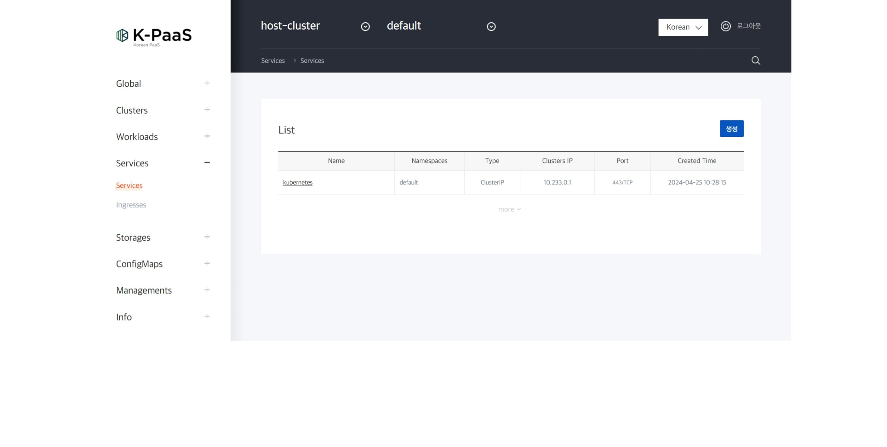


2. "생성" 버튼을 눌러 서비스 생성창을 띄운다.
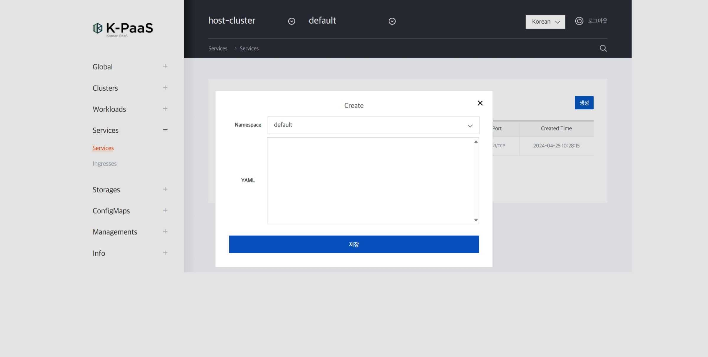


3. 서비스를 생성할 네임스페이스를 선택한 후 코드를 작성한다.


4. 코드에 문제가 없다면 정상적으로 처리되었다는 팝업창이 뜬다.
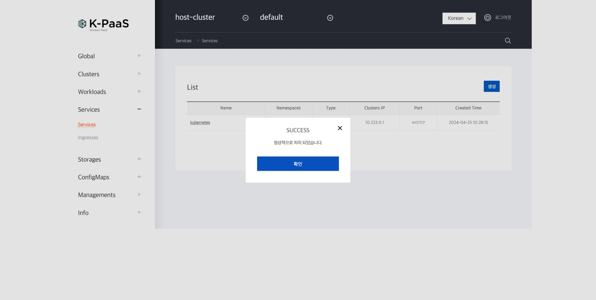


5. 다음과 같이 서비스가 생성된 모습을 확인할 수있다.


다음 코드는 서비스를 생성하는 yaml이다.
다음 코드를 참고하여 컨테이너 플랫폼 포탈에서 서비스를 생성한다.

```

apiVersion: v1
kind: Service
metadata:
  name: wordpress-mysql
  labels:
    app: wordpress
spec:
  ports:
    - port: 3306
      protocol: TCP
  selector:
    app: wordpress
    tier: mysql

```
<br>


## <div id='3-2'/>3.2. 컨테이너플랫폼 포털을 활용한 WordPress 배포

### <div id='3-2-1'/> 3.2.1. 퍼시스턴트 볼륨 생성

1. 포탈에 접속을 성공한 이후에 퍼시스턴트 볼륨을 배포하기위해 Storage > Persistenct Volume 버튼을 눌러 접속을 진행한다.


2. "생성" 버튼을 눌러 퍼시스턴트 볼륨 생성창을 띄운다.
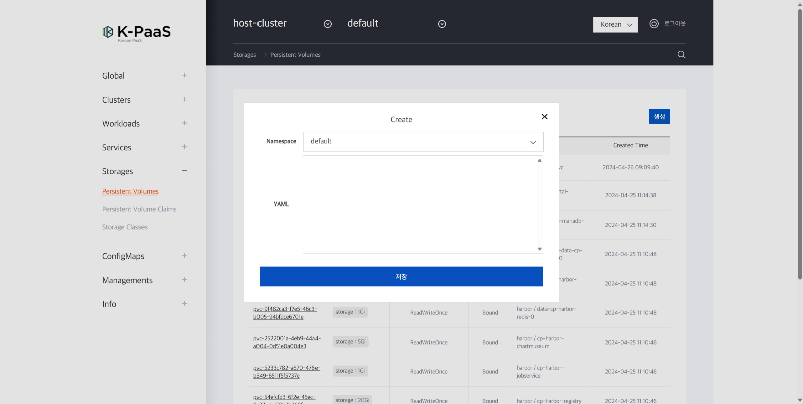


3. 퍼시스턴트 볼륨을 생성할 네임스페이스를 선택한 후 코드를 작성한다.
- 작성을 마치면 "저장" 버튼을 누른다.
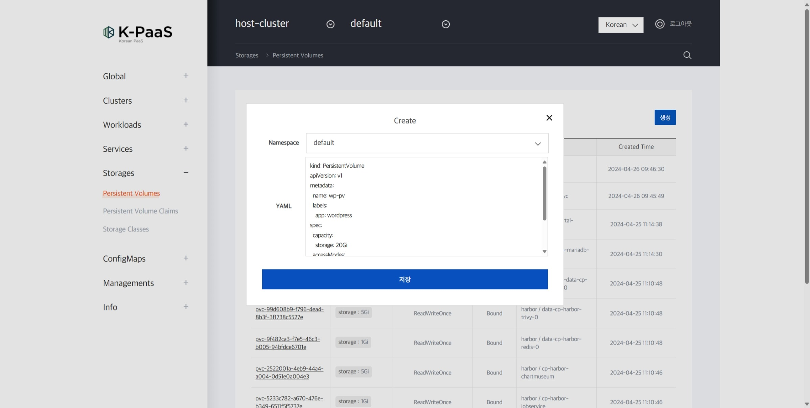


4. 코드에 문제가 없다면 정상적으로 처리되었다는 팝업창이 뜬다.


5. 다음과 같이 퍼시스턴트 볼륨이 생성된 모습을 확인할 수있다.
이미지 추가


다음 코드는 퍼시스턴트 볼륨을 생성하는 yaml이다.
다음 코드를 참고하여 컨테이너 플랫폼 포탈에서 퍼시스턴트 볼륨을 생성한다.

```

kind: PersistentVolume
apiVersion: v1
metadata:
  name: wp-pv
  lables:
    app: wordpress
spec:
  capacity:
    storage: 20Gi
  accessModes:
    - ReadWriteOnce
  hostPath:
    path: "/data/k8s/wp"
  storageClassName: cp-storageclass
  
```

### <div id='3-2-2'/> 3.2.2. 퍼시스턴트 볼륨 클레임 생성

1. 퍼시스턴트 볼륨 클레임을 배포하기위해 Storage > Persistenct Volume Claims 버튼을 눌러 접속을 진행한다.
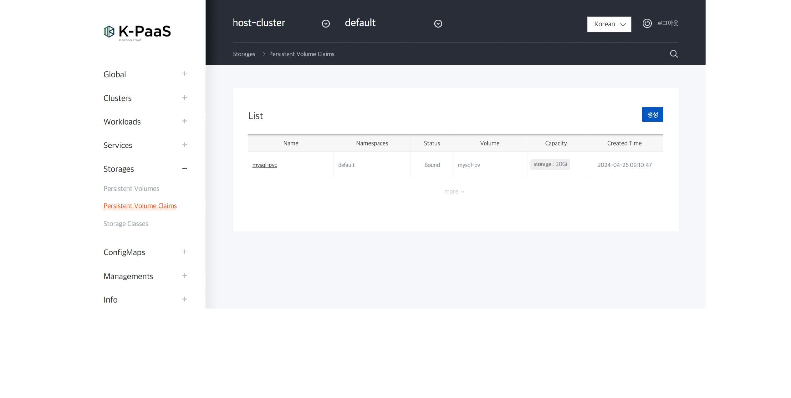


2. "생성" 버튼을 눌러 퍼시스턴트 볼륨 클레임 생성창을 띄운다.


3. 퍼시스턴트 볼륨 클레임을 생성할 네임스페이스를 선택한 후 코드를 작성한다.
- 작성을 마치면 "저장" 버튼을 누른다.


4. 코드에 문제가 없다면 정상적으로 처리되었다는 팝업창이 뜬다.
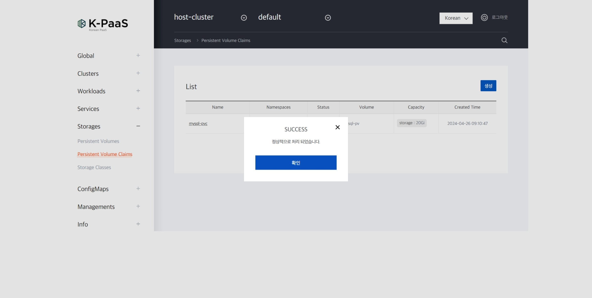


5. 다음과 같이 퍼시스턴트 볼륨이 생성된 모습을 확인할 수있다.


```

apiVersion: v1
kind: PersistentVolumeClaim
metadata:
  name: wp-pvc
  labels:
    app: wordpress
spec:
  accessModes:
    - ReadWriteOnce
  resources:
    requests:
      storage: 20Gi


```

### <div id='3-2-3'/> 3.2.3. WordPress 디플로이먼트 생성


1. WordPress를 디플로이먼트 형식으로 배포하기위해서 Workloads > Deployments 버튼을 눌러 접속을 진행한다.


2. "생성" 버튼을 눌러 디플로이먼트 생성창을 띄운다.


3. 디플로이먼트를 생성할 네임스페이스를 선택한 후 코드를 작성한다.
- 작성을 마치면 "저장" 버튼을 누른다.
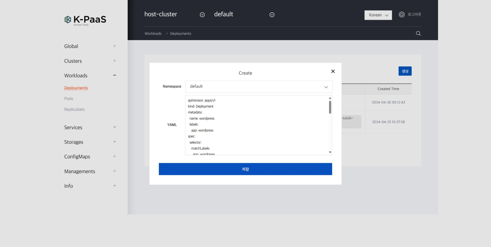


4. 코드에 문제가 없다면 정상적으로 처리되었다는 팝업창이 뜬다.
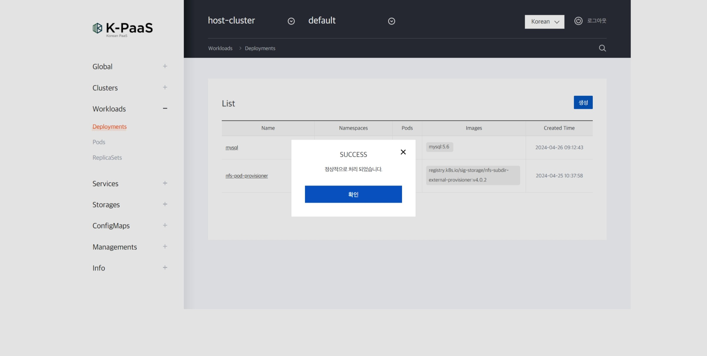


5. 다음과 같이 디플로이먼트가 생성된 모습을 확인할 수있다.
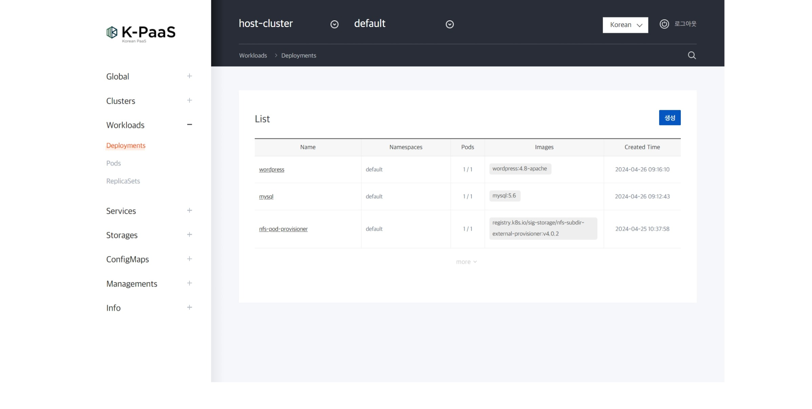


다음 코드는 디플로이먼트를 생성하는 yaml이다.
다음 코드를 참고하여 컨테이너 플랫폼 포탈에서 디플로이먼트를 생성한다.


```

apiVersion: apps/v1
kind: Deployment
metadata:
  name: wordpress
  labels:
    app: wordpress
spec:
  selector:
    matchLabels:
      app: wordpress
      tier: frontend
  strategy:
    type: Recreate
  template:
    metadata:
      labels:
        app: wordpress
        tier: frontend
    spec:
      containers:
      - image: wordpress:4.8-apache
        name: wordpress
        env:
            - name: WORDPRESS_DB_HOST
              value: wordpress-mysql
            - name: WORDPRESS_DB_NAME
              value: wordpress
            - name: WORDPRESS_DB_USER
              value: root
            - name: WORDPRESS_DB_PASSWORD
              value: password
        ports:
        - containerPort: 80
          name: wordpress
        volumeMounts:
        - name: wordpress-persistent-storage
          mountPath: /var/www/html
      volumes:
      - name: wordpress-persistent-storage
        persistentVolumeClaim:
          claimName: wp-pvc

```

### <div id='3-2-4'/> 3.2.4. WordPress 서비스 생성


1. 서비스를 배포하기위해서 Services > Services 버튼을 눌러 접속을 진행한다.
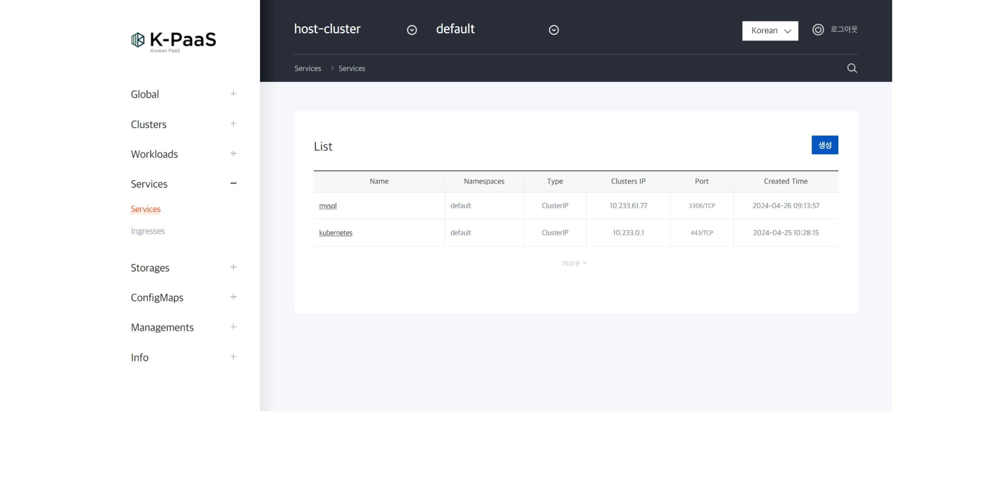


2. "생성" 버튼을 눌러 서비스 생성창을 띄운다.


3. 서비스를 생성할 네임스페이스를 선택한 후 코드를 작성한다.
- 작성을 마치면 "저장" 버튼을 누른다.


4. 코드에 문제가 없다면 정상적으로 처리되었다는 팝업창이 뜬다.


5. 다음과 같이 서비스가 생성된 모습을 확인할 수있다.


다음 코드는 서비스를 생성하는 yaml이다.
다음 코드를 참고하여 컨테이너 플랫폼 포탈에서 서비스를 생성한다.

```

apiVersion: v1
kind: Service
metadata:
  name: wordpress
  labels:
    app: wordpress
spec:
  ports:
    - port: 80
  type: NodePort
  selector:
    app: wordpress
    tier: frontend

```

### <div id='3-2-5'/> 3.2.5. WordPress 접속

- http://{K-PaaS_Master_Node_IP}:{WordPress_NodePort_IP}로 접속을 확인한다.
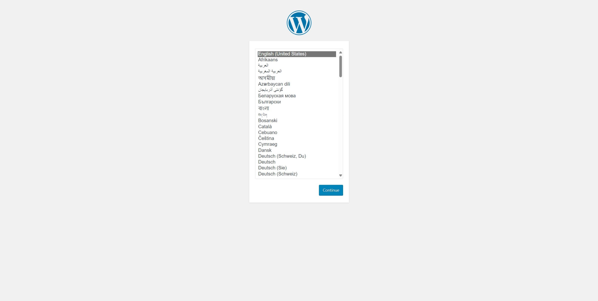

# <div id='4'/> 4. 컨테이너 플랫폼 포탈을 활용한 MySQL과 WordPress 삭제

## <div id='4-1'/> 4.1. 컨테이너 플랫폼 포탈을 활용한 MySQL 삭제

