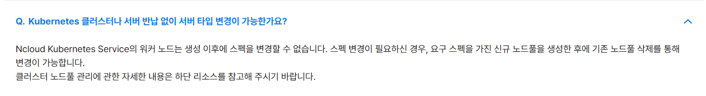
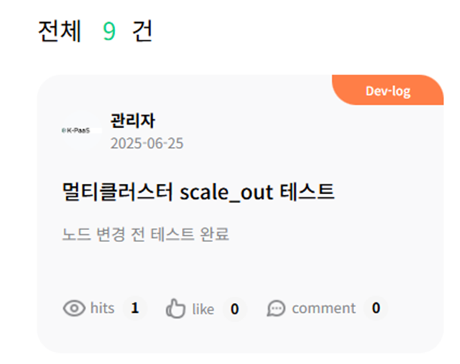

## [대표 포털] 멀티 클러스터 Scale out/in 가이드

<br>

## Table of Contents
1. [문서 개요](#1)    
   1.1. [목적](#1.1)  
   1.2. [범위](#1.2)  

2. [정보](#2)  
   2.1. [Prerequisite](#2.1)  
   2.2. [배포 목록](#2.2)  
   2.3. [자원 확인](#2.3)  

3. [scale out](#3)  
   3.1. [NHN cluster scale out](#3.1)  
   3.1.1 [정상 작동 확인](#3.1.1)  
   3.2. [NCP cluster node scale out](#3.2)  
   3.2.1 [ nodepool scale out (방법 1)](#3.2.1)     
   3.2.2 [ nodepool scale out (방법 2)](#3.2.2)     
   3.3.[노드 추가 및 삭제 정상 작동 확인 테스트](#3.3)  

4. [scale in](#4)  
   4.1. [NHN cluster scale in](#4.1)  
   4.1.1 [정상 작동 확인](#4.1.1)  
   4.2. [NCP cluster node scale in](#4.2)  
   4.2.1 [nodepool scale in](#4.2.1)     
   4.2.2 [정상 작동 확인](#4.2.1)     


<br><br>
   
## <span id='1'> 1. 문서 개요
### <span id='1.1'> 1.1. 목적
본 문서(`대표 포털 멀티 클러스터 scale out 가이드`)에서는 현재 대표 포털이 배포되어진 멀티 클러스터와 동일한 상태의 클러스터를 생성하여 scale out/in하는 테스트 과정과 방법을 기술하였다.

<br>

### <span id='1.2'>1.2. 범위
`CSP 쿠버네티스 서비스` 클러스터를 대상으로 Istio를 이용하여 `멀티 클러스터`를 구성하였다.
본 문서에서는 `nhn cloud`와 `naver cloud` 환경에서 scale out/in 테스트 과정과 방법을 기술하였다.


## <span id='2'> 2. 테스트 환경 정보

### <span id='2.1'>2.1. Prerequisite
현재 대표 포털이 배포되어있는 멀티 클러스터와 비슷한 환경을 재현하기 위해 샘플앱 배포하여 자원 많이 쓰는 상태에서 진행한다.

db는 구축하지 않고 개발 서버용을 사용함

- 현재 운영 멀티 클러스터 자원 상태
```bash
#ncp-cluster
ncloud@ncp-kpaas-nodepools-w-2hna:~$ kubectl config use-context ncp-kpaas-cluster
Switched to context "ncp-kpaas-cluster".
ncloud@ncp-kpaas-nodepools-w-2hna:~$ kubectl top node
NAME                         CPU(cores)   CPU%   MEMORY(bytes)   MEMORY%   
ncp-kpaas-nodepools-w-2hna   193m         4%     9019Mi          67%       
ncp-kpaas-nodepools-w-2hnb   352m         8%     9602Mi          72%  

#nhn-cluster
ncloud@ncp-kpaas-nodepools-w-2hna:~$ kubectl config use-context nhn-kpaas-cluster
Switched to context "nhn-kpaas-cluster".
ncloud@ncp-kpaas-nodepools-w-2hna:~$ kubectl top node
NAME                                      CPU(cores)   CPU%   MEMORY(bytes)   MEMORY%   
nhn-kpaas-cluster-default-worker-node-0   1173m        29%    10609Mi         66%     
```


### <span id='2.2'>2.2. 베포 목록

- 대표포털 동일하게 배포

`kps-api-business`<br>
`kps-api-opperate`<br>
`kps-api-common`<br>
`kps-api-support`<br>
`kps-api-edu`<br>
`kps-api-content`<br>
`kps-web-user`<br>
`kps-web-admin`<br>
`kps-zuul-gateway`<br>

```bash
$ kubectl get pod -n kps2 --context=ncloud
NAME                               READY   STATUS    RESTARTS   AGE
kps-api-common-7777f79d7f-2l4g9    2/2     Running   0          5h7m
kps-api-common-7777f79d7f-mhrvp    2/2     Running   0          5h7m
kps-api-content-6f84fd6b5b-2ff7g   2/2     Running   0          5h7m
kps-api-content-6f84fd6b5b-mpxtr   2/2     Running   0          5h7m
kps-api-operate-79c4f89d9b-hktns   2/2     Running   0          5h7m
kps-api-operate-79c4f89d9b-jpqpz   2/2     Running   0          5h7m
kps-api-support-868d474448-9lj5x   2/2     Running   0          5h7m
kps-api-support-868d474448-crq5w   2/2     Running   0          5h7m
kps-redis-6cb7c546dd-gtp7s         2/2     Running   0          4h28m
kps-web-user-65b9467754-2dbmr      2/2     Running   0          3h5m
kps-web-user-65b9467754-chlq2      2/2     Running   0          3h5m
kps-web-user-65b9467754-t7qx6      2/2     Running   0          3h5m
kps-zuul-gateway-fd576cdcb-qb8xv   2/2     Running   0          5h6m

$ kubectl get pod -n kps2 --context=nhn
NAME                               READY   STATUS    RESTARTS      AGE
kps-api-business-9cb48dcb8-5vbsk   2/2     Running   4 (13m ago)   21h
kps-api-business-9cb48dcb8-bxhfk   2/2     Running   4 (13m ago)   21h
kps-api-edu-6569df6b6f-5h72n       2/2     Running   4 (13m ago)   21h
kps-api-edu-6569df6b6f-9d5rk       2/2     Running   4 (13m ago)   21h
kps-web-admin-556944d44b-5pkt9     1/1     Running   3 (11m ago)   46h
kps-web-admin-556944d44b-7fpdq     1/1     Running   2 (13m ago)   46h
kps-web-admin-556944d44b-kzv2q     1/1     Running   2 (13m ago)   46h
```
> 정상 접속 확인


### <span id='2.2'>2.3. 자원 확인
- 자원 사용량 확인
   - 대표 포털 운영 클러스터 비슷한 수준임을 확인 후 진행함.
```bash
$ kubectl top node --context=ncloud
NAME                      CPU(cores)   CPU%   MEMORY(bytes)   MEMORY%   
portal-test-node-w-3f6k   467m         24%    5371Mi          88%       
portal-test-node-w-3f6l   435m         22%    4446Mi          73%   

$ kubectl top node --context=nhn
NAME                                        CPU(cores)   CPU%   MEMORY(bytes)   MEMORY%   
portal-test-cluster-default-worker-node-0   588m         29%    5278Mi          66%  
```
## <span id='3'> 3. scale out
### <span id='3.1'> 3.1. NHN cluster scale out
> nhn cluster node spec 변경 가능

1. nhncloud 로그인 후 `Cluster > NHN Kubernetes Service(NKS)` 접속한다.
2. 변경할 클러스터의 노드 그룹을 선택한다.


3. 노드그룹에서 선택한 다음, 인스턴스 타입에서 변경 선택한다.


4. 인스턴스 타입을 선택한다.


5. 작업상태가 변하고 노드 스펙 변경이 진행된다.
   


6. 노드 스펙 변경 확인


### <span id='.1.1'> 3.1.1 정상 작동 확인
> 노드 스펙변경시작부터 파드가 완전히 올라오는 것까지 약 7~10분 소요
> nhncloud 운영 클러스터의 경우 노드가 1개로 구성되어있어 순단 발생 가능성 있음


### <span id='3.2'> 3.2. NCP cluster node scale out
 
 >naver cloud 환경에서 기존에 사용하던 노드(IP)변경없이 scale out은 불가능함을 확인 <br>
 >따라서 변경할 스펙으로 노드풀을 추가한 다음 기존에 사용중인 노드풀을 삭제해도 멀티 클러스터가 정상적으로 작동하는지를 확인하는 절차를 진행한다.


### <span id='3.2.1'> 3.2.1 nodepool scale out (방법 1)

1. naver cloud 로그인 후 `NCloud Kubernetes Service(NKS) > Cluster ` 접속한다.
2. 변경할 클러스터를 선택한다.
3. 노드풀 > 노드풀 추가를 선택한다.


4. 추가할 노드풀의 설정을 작성한다.


5. 작성한 내용을 확인하고 생성하기를 누른다.


6. 노드가 작업중인 것을 확인한다.


7. 노드풀 추가가 완료된 것을 확인한다.


```bash
# 아래명령어로도 확인 가능
$ kubectl get node --context=ncloud
NAME                         STATUS   ROLES    AGE    VERSION
portal-test-node-02-w-7090   Ready    <none>   10m    v1.32.3
portal-test-node-02-w-8059   Ready    <none>   10m    v1.32.3
portal-test-node-w-3f6k      Ready    <none>   3d5h   v1.32.3
portal-test-node-w-3f6l      Ready    <none>   3d5h   v1.32.3
```

8. 기존 노드풀을 삭제하기 위해 선택한다.
- 주의사항
기존의 노드풀을 삭제하게되면 서버자원까지 모두 삭제가 진행된다.<br>
해당 서버 안에 있는 자원들의 백업 절차가 선행적으로 필요하다. <br>


9. 삭제를 누른다.


10.  기존 노드풀이 삭제된 것을 확인한다.

테스트 환경의 경우 [외부IP]:[노드포트] 형식으로 접근 가능<br>
새로 생성된 서버에 접속하여 CSP 쿠버네티스 서비스 Istio 멀티 클러스터 구성 가이드(NAVER-NHN)의 3번부터 4.1까지 실행<br>
>변경된 공인ip값으로 정상 접속 확인


### <span id='3.2.2'> 3.2.2 nodepool scale out (방법 2)
노드풀을 생성한 다음 기존 노드풀 모두를 삭제하지 말고 순차적으로 업그레이드 및 삭제를 진행하는 방법

1. 노드풀 추가

노드풀 추가는 nodepool scale out (방법 1)을 참고하여 생성하되 노드수를 1개로 선택한다.
 

<br>


1. 기존 노드풀에서 하나의 노드를 먼저 선행적으로 삭제를 진행


<br>


```bash
$ kubectl get node --context=ncloud
NAME                         STATUS   ROLES    AGE   VERSION
portal-test-node-02-w-7090   Ready    <none>   81m   v1.32.3
portal-test-node-03-w-7104   Ready    <none>   22m   v1.32.3
```

>정상 접속 확인


>노드 추가 전

- vCPU 8EA, Memory 32GB(vCPU 4EA, Memory 16GB * 2개) 스펙 업그레이드시 자원상태
```bash
$ kubectl top node
NAME                         CPU(cores)   CPU%   MEMORY(bytes)   MEMORY%   
portal-test-node-02-w-7090   893m         22%    9208Mi          69%       
portal-test-node-03-w-563f   51m          1%     810Mi           6% 
```


### <span id='3.3'> 3.3 노드 추가 및 삭제 정상 작동 확인 테스트
1. 노드 추가 전 정상 작동 확인



```bash
# 노드 추가 전 
$ kubectl get node
NAME                         STATUS   ROLES    AGE     VERSION
portal-test-node-02-w-7090   Ready    <none>   5d1h    v1.32.3
portal-test-node-03-w-563f   Ready    <none>   2d1h    v1.32.3
```


2. 노드 추가 후 정상 작동 확인


```bash
# portal-test-node-01-w-5ca7 추가
$ kubectl get node
NAME                         STATUS   ROLES    AGE     VERSION
portal-test-node-01-w-5ca7   Ready    <none>   2m38s   v1.32.3 ##추가된 노드
portal-test-node-02-w-7090   Ready    <none>   5d1h    v1.32.3
portal-test-node-03-w-563f   Ready    <none>   2d1h    v1.32.3
```

3. 노드 삭제 후 정상 작동 확인(storage 확인)

> pvc-e23465dbb1da4b649f5f51e78e이 붙어있는 노드 3삭제


> 해제된 pv 사용 가능, 잔여 자원으로 남아있음


>해제된 자원은 새로 생성한 노드에 연결 가능


- 노드 추가와 삭제를 진행한 다음에도 정상적으로 작동함을 확인


- 노드 변경 이후 파일 업로드 기능도 문제 없음

```bash
# portal-test-node-03-w-563f 삭제
$ kubectl get node
NAME                         STATUS   ROLES    AGE     VERSION
portal-test-node-01-w-5ca7   Ready    <none>   2m38s   v1.32.3
portal-test-node-02-w-7090   Ready    <none>   5d1h    v1.32.3
```

#### 운영 클러스터 사용 storage
- 대표 포털 운영 클러스터 storage
   - node 1<br>

   - node 2<br>


pvc-59507a17d531456c9dd5e40af6 (jenkins)<br>
pvc-8d886ebde11c495aa22e22f0da (공모전 log)<br>
backup-pv-volume (포털 log) hostpath(vm 삭제시 유실)
```bash
Name:            backup-pv-volume
Labels:          <none>
Annotations:     pv.kubernetes.io/bound-by-controller: yes
Finalizers:      [kubernetes.io/pv-protection]
StorageClass:    nks-block-storage
Status:          Bound
Claim:           kps/backup-pv-claim
Reclaim Policy:  Retain
Access Modes:    RWX
VolumeMode:      Filesystem
Capacity:        10Gi
Node Affinity:   <none>
Message:         
Source:
    Type:          HostPath (bare host directory volume)
    Path:          /data/logs
    HostPathType:  
Events:            <none>

$ cd /data/logs/
$ ls
2025-04-16  2025-05-26	2025-05-28  2025-05-30	2025-06-01  2025-06-03	2025-06-05  2025-06-07	2025-06-09  2025-06-11	2025-06-13  2025-06-15	2025-06-17  2025-06-19	2025-06-21  2025-06-23	2025-06-25  content.log  operate.log  user.log
2025-05-25  2025-05-27	2025-05-29  2025-05-31	2025-06-02  2025-06-04	2025-06-06  2025-06-08	2025-06-10  2025-06-12	2025-06-14  2025-06-16	2025-06-18  2025-06-20	2025-06-22  2025-06-24	common.log  contest	 support.log  zuul.log
```


- 현재 node1에서 crontab 작동중
```bash
# portal log backup(backup-pv-volume)
0 23 * * * /home1/ncloud/workspace/config/log/backup-logs.sh >> /home1/ncloud/workspace/config/log/cron.log 2>&1

# contest log backup(pvc-8d886ebde11c495aa22e22f0da)
0 23 * * * /home1/ncloud/contest/config/log/log-dump.sh >> /home1/ncloud/contest/config/log/log-dump-cron.log 2>&1
```

-  CSP 쿠버네티스 서비스 Istio 멀티 클러스터 구성 시 별도의 nfs 설정 없음

#### 노드 추가 및 삭제 이후 확인 사항
1. Istio remote secret 동기화 상태 점검<br>
`istioctl remote-clusters` 명령어를 통해 상태가 synced인지 확인

2. 각 클러스터의 istiod 상태 확인<br>
`kubectl get pods -n istio-system` 등으로 istiod pod 정상 동작 여부 확인

3. (필요시) LoadBalancer 변경 여부 확인 및 업데이트(lb는 변경되지 않으나 확인은 필요)<br>
공모전도 동일 LB 사용

4. redis는 내부 ip로 연동되고 있어 노드 변경 이후에도 문제 없을 것으로 예상 (운영 클러스터와 같은 vpc, subnet)
```sh
#spring application-prd.properties
spring.redis.host=ENC(iWbiXQgUkdeSiYGeHKbH1RsnuxvdHmWz) #10.0.10.8
```
5. redis server acg 변경 (22port 개방 필요(변경된 vm))

6. 변경된 노드 IP로 db acg 변경 필요


## <span id='4'> 4. scale in
scale in 하는 과정은 2. scale out과 과정은 동일하여 자세한 방법은 2.scale out을 참조한다.
### <span id='4.1'> 4.1. NHN cluster scale in
- 변경 전


- 스펙 변경 후


### <span id='4.1.1'> 4.1.1 정상 작동 확인

### <span id='4.2'> 4.2. NCP cluster node scale in
### <span id='4.2.1'> 4.2.1 nodepool scale in
1. scale in할 노드풀 추가


2. 기존 노드풀 삭제


### <span id='4.2.2'> 4.2.2 정상 작동 확인
